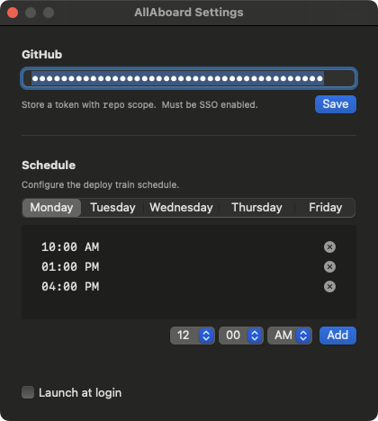
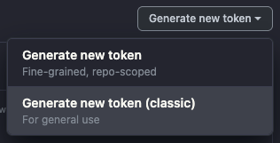
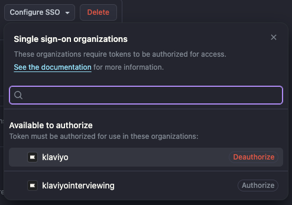
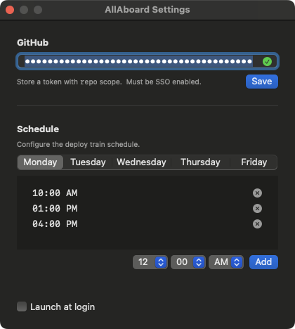

# All Aboard 🚂

All Aboard is a macOS menu bar app that reminds you to show your ticket 10m before deploy trains _only_ if you have any PRs that are `ready-to-merge`.

---

## ⚙️ Configuration

After installing the app, follow these steps to configure it:

### 1. Launch the App

Once launched, All Aboard lives in your macOS menu bar:


---

### 2. Open Preferences

Click the menu bar icon and select **Settings** to open the configuration panel:



---

### 3. Create a GitHub Personal Access Token

To check for your open PRs, All Aboard needs a GitHub Personal Access Token (PAT) with the `repo` scope.

1. Visit: [https://github.com/settings/tokens](https://github.com/settings/tokens)
2. Click **"Generate new token (classic)"**
3. Set the expiration (e.g. 90 days)
4. **Select the `repo` scope**:
5. Click **"Generate token"**
6. **Copy the token** — you won't be able to see it again!



---

### 4. Authorize the Token with SSO

In order to be able to see `app` PRs in the Klaviyo organization, you need **Configure SSO** after creation.

1. After generating the token, visit:
   [https://github.com/settings/tokens](https://github.com/settings/tokens)
2. You'll see a button next to your token like:
   **“Configure SSO”**
3. Click it and authenticate using Okta



---

### 5. Save the Token in the App

Paste your token into the field in Preferences and click **Save**. You’ll see a green checkmark if successful.



---

### ✅ That’s it!

All Aboard will now:
- Monitor your PRs labeled `ready-to-merge`
- Notify you 10m before each scheduled deploy train

---

### 🛠 Troubleshooting

- If you don't see notifications, ensure the app has permission:
  `System Settings → Notifications → All Aboard`
- To reset app state, run:
  ```bash
  defaults delete com.crcarrick.allaboard
  ```